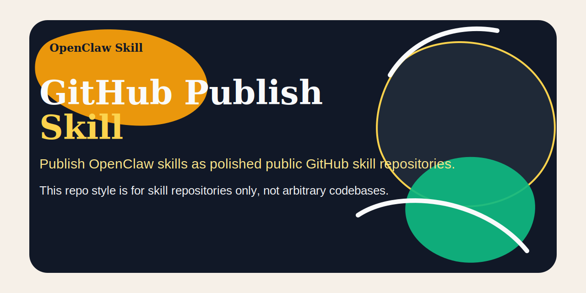

# GitHub Publish Skill

English | [简体中文](README.zh-CN.md)




Publish or upgrade an OpenClaw skill as a polished public GitHub skill repository.

## Quick pitch

Publish OpenClaw skills as polished public GitHub skill repositories.
Important: this repo style applies to skill repos only, not arbitrary codebases.

## Why this exists

Publishing a skill to GitHub is easy to do badly.

A raw folder dump technically works, but it creates a repo that looks half-finished, hides the packaged artifact, blurs the skill's lane, and forces future readers to reverse-engineer how the repo is meant to be used. Worse, once a few public skill repos exist, inconsistent presentation makes the whole family look accidental.

`github-publish-skill` exists to stop that.

It combines two things into one canonical workflow:

- publishing or republishing an OpenClaw skill repo to GitHub
- shaping that repo so it looks complete, standalone, and reusable as a public skill repository

## Works independently

`github-publish-skill` stands on its own.

Use it whenever the repo being published is primarily an OpenClaw skill repo. It does not depend on the rest of the skill family to make sense.

Just as important, it has a hard boundary: the public-repo style guidance in this repo applies only to skill repositories. Do not use it as a generic styling standard for apps, libraries, or arbitrary code repos.

## What the skill teaches

The skill tells the agent to:

- validate the skill before publishing
- package the `.skill` artifact cleanly
- build a public repo payload that includes README, LICENSE, CONTRIBUTING, packaged artifact, and skill source
- structure the README so the repo is independently understandable
- use a consistent badge, banner, and social-preview pattern for public skill repos
- keep banner graphics out of the text area so the headline and support copy stay readable at repo scale
- prefer a clean text-first banner over decorative filler, especially on the right side
- align repo description and topics with the skill's real scope
- keep related skill repos visually coherent without creating hidden dependencies
- preserve the hard boundary that this style is for skill repos only

## When to use it

Use `github-publish-skill` when:

- creating a new public repo for a reusable OpenClaw skill
- republishing an existing skill after updates
- standardizing README, badges, CONTRIBUTING, metadata, and social-preview assets for a skill repo
- upgrading a public skill repo so it looks complete and independently understandable

Do not use it for general software projects, apps, libraries, or mixed-purpose repos.

## Example behavior

### Example 1: first public release of a skill

A reusable workspace skill is ready to share publicly.

A good agent should:

1. validate the skill and package the `.skill` artifact
2. create the repo payload with README, LICENSE, CONTRIBUTING, skill source, and `dist/`
3. write a README that makes the repo self-contained
4. publish the repo and align its metadata with the skill trigger language

### Example 2: upgrading an older public skill repo

An existing public skill repo works, but looks inconsistent with the newer skill family.

A good agent should:

1. preserve the skill logic and packaged artifact
2. upgrade the README structure, badges, and social-preview section
3. add `CONTRIBUTING.md` if missing
4. keep the repo independently useful rather than turning it into a pointer page

### Example 3: scope mistake

Someone suggests reusing this style for a generic app repo.

A good agent should refuse the scope creep and note that this style standard is for skill repositories only.

## Related skills

These are related, not required:

- `multi-task-continuity`: an example of a polished umbrella skill repo — <https://github.com/ruanrrn/multi-task-continuity>
- `task-orchestrator`: an example of a focused lane skill repo — <https://github.com/ruanrrn/task-orchestrator>
- `task-state-sync`: an example of a focused continuity skill repo — <https://github.com/ruanrrn/task-state-sync>

Use this repo when the problem is publishing the skill repo itself.

## Social preview

Suggested social preview asset: `assets/social-preview.svg`

Suggested one-line copy:

> Publish OpenClaw skills as polished public GitHub skill repositories.

GitHub note:

- The current `gh` CLI and GraphQL `UpdateRepositoryInput` do not expose a writable custom social preview field.
- To use this image as the repository social preview, upload `assets/social-preview.svg` manually in the repo settings UI.

## What you get

- `github-publish-skill/` - the skill source
- `github-publish-skill/references/public-skill-style.md` - style blueprint for public skill repositories
- `dist/github-publish-skill.skill` - packaged artifact ready to import

## Install

Use either path:

1. Import `dist/github-publish-skill.skill` into an OpenClaw environment.
2. Copy `github-publish-skill/` into your skills directory if you want the editable source.

## Repository layout

```text
github-publish-skill/
├── LICENSE
├── README.md
├── CONTRIBUTING.md
├── assets/
│   └── social-preview.svg
├── github-publish-skill/
│   ├── SKILL.md
│   └── references/
│       └── public-skill-style.md
└── dist/
    └── github-publish-skill.skill
```

## Contributing

See `CONTRIBUTING.md` for contribution scope, PR expectations, and how to keep this repo focused on skill-repo publishing instead of becoming a universal GitHub styling kit.

## Release hygiene

- Regenerate `dist/github-publish-skill.skill` after each material skill change
- Keep the repository description aligned with the skill trigger language
- Keep the hard boundary explicit: this style guidance applies only to skill repositories
- Keep the repo narrow and practical; no unrelated GitHub repo-fashion experiments

## Repository

- GitHub: `https://github.com/ruanrrn/github-publish-skill`
- License: MIT
